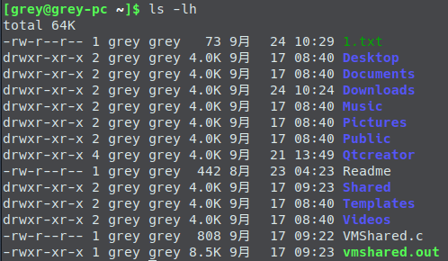

# Linux Top 10 Comamnds

- [Linux Top 10 Comamnds](#linux-top-10-comamnds)
    - [1. `mkdir`: make directory](#1-mkdir-make-directory)
    - [2. `rmdir`: remove directory](#2-rmdir-remove-directory)
    - [3. `cd`: change directory](#3-cd-change-directory)
    - [4. `list`: list files and directories](#4-list-list-files-and-directories)
    - [5. `cat`: concatenate](#5-cat-concatenate)
    - [6. `less`: display output one screen at a time](#6-less-display-output-one-screen-at-a-time)
    - [7. `cp`: copy](#7-cp-copy)
    - [8. `mv`: move](#8-mv-move)
    - [9. `rm`: remove](#9-rm-remove)
    - [10. `chmod`: change the file mode](#10-chmod-change-the-file-mode)

## 1. `mkdir`: make directory

```shell
#normal
mkdir NewFolder0

#if NewFolder0 doesn't exist
mkdir NewFolder0/SubFolder

#if NewFolder1 exists
mkdir -p NewFolder1/SubFolder
```

## 2. `rmdir`: remove directory

```shell
rmdir NewFolder0

rmdir -p NewFolder1/SubFolder
```

## 3. `cd`: change directory

```shell
#change directory to user directory, such as "/home/grey" or ~
cd

#change directory to current directory(no need)
cd .

#change directory to parent directory
cd ..

##examples
#to root directory
cd /

#等价于cd Downloads
cd ./Downloads

cd /boot/grub/

cd ../grey/

cd ../../
```

## 4. `list`: list files and directories

```shell
#list directory
ls

#list all even with hidden directory
ls -a

#using a long list
ls -l

#using a human type to list
ls -h

#list Reverse order
ls -r

#list Recursive
ls -R

#examples
ls Qtcreator/untitled/*c
```

## 5. `cat`: concatenate

```shell
#concatenate files (copy stdin to stdout)
cat
cat -

#examples
cat >1.txt
cat >2.txt
cat >>3.txt
cat 1.txt 2.txt
cat 1.txt - 2.txt
cat 3.txt
```

## 6. `less`: display output one screen at a time

```shell
#Display output one screen at a time
#一般用vim, nano代替
less 1.txt
```

## 7. `cp`: copy

```shell
#backup file
cp fedora.repo fedora.repo.bak
cp fedora-update.repo fedora-update.repo.bak

#copy multiple files to folder
cp *.txt ..Downnloads

#normal
sudo cp hosts /etc/hosts
```

## 8. `mv`: move

```shell
#rename a file
mv 1.txt one.txt

#normal
sudo mv hosts /etc/hosts
```

## 9. `rm`: remove

```shell
#normal
rm 1.txt

#remove multiple files
rm *.txt

#remove force
rm -f

#remove Recursive
rm -r
rm -R
```

## 10. `chmod`: change the file mode

文件权限类型介绍：从左往右按照下图依次为

1. 文件类型
    - **普通文件 `-`**
    - **directory `d`**
1. 权限: 所有者 `u`, 用户组 `g`, 其他用户 `o`,所有用户`a`
    - `r`: read, 4
    - `w`: write, 2
    - `x`: execute, 1
    - `-`: none, 0
1. 包含的文件个数，包含`.`,`..`
1. 文件所有者
1. 所有者所在的用户组
1. 文件大小
1. 文件日期时间
1. 文件名



```shell
chmod u=r,g=r,o=w 1.txt

chmod u=rw 1.txt

chmod g=rw 1.txt

chmod o+w 1.txt

chmod 755 Downloads/*
```