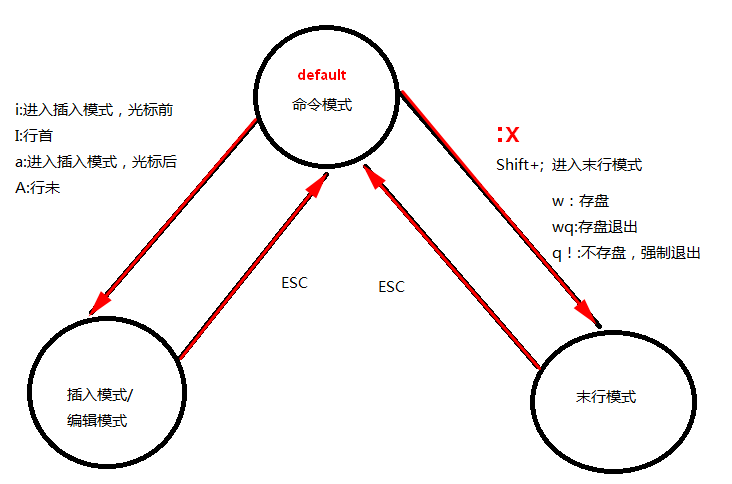
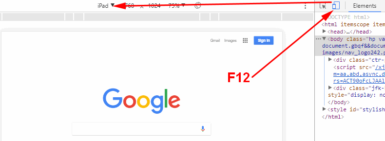
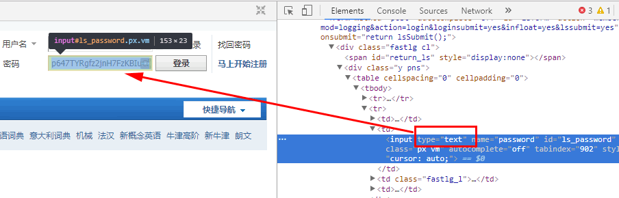

# Linux Tools

<!-- TOC -->

- [Linux Tools](#linux-tools)
    - [About programming language](#about-programming-language)
    - [Vim](#vim)
    - [ftp(File Transfer Protocol)](#ftpfile-transfer-protocol)
    - [About Chrome](#about-chrome)
        - [Chrome可以显示不同设备时，网页的调整`F12`](#chrome可以显示不同设备时网页的调整f12)
        - [获取密码框的密码](#获取密码框的密码)
    - [ssh & scp](#ssh--scp)

<!-- /TOC -->

## About programming language

Web:

```bash
HTML是内容，CSS让内容美化(统一网站风格)，Javascript处理事件(click, double-click)
现在网页一般是HTML+CSS+JS
```

做服务器：

```bash
go #future
python,
java,
php,
node.js,
.net #outdated
```

## Vim

vim是vi(Visual interface)的升级

在命令模式下输入插入命令`i`、附加命令`a` 、打开命令`o`、修改命令`c`、取代命令`r`或替换命令`s`都可以进入文本输入模式




```bash
#vim search
Esc
#search text
/text
```

```bash
#using vim to write C
vim test.c
gcc test.c
tree
./a.out
```

常用：

```bash
#复制一行并粘贴4次
yy
pppp
#复制光标及以下4行
4yy

#剪切一行
dd
2dd #剪切光标所在下2行
#剪切所有
dG
#剪切至光标行的末尾
D

#撤销
u
#反撤销
Ctrl+r
```

```bash
#当前屏幕的最上面一行
H
#当前屏幕的中间一行
M
#当前屏幕的最下面一行
L
```

```bash
#整体缩进
v
上下选择
>>移动
.重复上面的操作
```

```bash
#一片一片代码跳
{}
```

```bash
#定位20行
20G
#定位到开始一行
gg
#定位到最后一行
G
```

如果vim没有正常的关闭，会自动生成`.xxx.py.swp`文件用于备份

```bash
#保存退出
:wq
:x
:q! #强制退出，不保存
#命令模式
shift+zz
```

```bash
#vi命令
vi命令
命令模式:
	yy:复制 光标所在的这一行
	4yy:复制 光标所在行开始向下的4行

	p: 粘贴

	dd:剪切 光标所在的这一行
	2dd:剪切 光标所在行 向下 2行
	D:从当前的光标开始剪切，一直到行末
	d0:从当前的光标开始剪切，一直到行首
	x:删除当前的光标，每次只会删除一个
	X:删除当前光标前面的那个，每次只会删除一个

	h左 j下 k上 l右

	H:当前屏幕的上方
	M:当前屏幕的中间
	L:当前屏幕的下方

	ctrl+f--->向下翻一页代码
	ctrl+b--->向上翻一页代码

	ctrl+d--->向下翻半页代码
	ctrl+u--->向上翻半页代码


	20G:快速的定位到第2行代码
	G:快速的回到 整个代码的最后一行
	gg:快速回到 整个代码的第1行

	w:向后跳一个单词的长度，即调到下一个单词的开始出
	b:向前跳一个单词的长度，即调到上一个单词的开始出

	u:撤销刚刚的操作
	ctrl+r:反撤销

	选中一片代码
	v:
	V:

	>>:向右移动代码
	<<:向左移动代码

	.:重复执行上一次的命令

	r:替换一个字符
	R:替换光标以及后面的字符

	shift+zz:相当于wq

末行模式:
	w:保存
	q:退出
	wq:保存并且推出
```


```python
# vim tip: to to line10
vim test.py +10
```

## ftp(File Transfer Protocol)

不建议用ftp,而要使用samba服务器;fedora默认带有samba

```bash
#1.install vsftpd
sudo dnf install vsftpd

#2.change the vsftpd.conf file
##in fedora
gedit /etc/vsftpd/vsftpd.conf

## in manjaro
gedit /etc/vsftpd.conf

#3.vsftpd.conf内容
##禁用匿名
anonymous_enable=NO
#..............
##本地模式，允许本机登陆
local_enable=YES
##文件末尾添加
local_root=/home/grey/ftp
##允许vsftpd.chroot_list文件中的用户登陆ftp服务器
chroot_list_enable=YES
chroot_list_file=/etc/vsftpd.chroot_list
##允许上传
write_enable=YES

#then add list
gedit /etc/vsftpd.chroot_list
#Add grey james
#去掉/home/grey/ftp文件夹的写权限
#重启服务
#登陆服务器
ftp 10.160.124.124
#upload
put file1
get file2
#或者使用GUI:filezilla
```

for [Fedora ftp help](https://docs-old.fedoraproject.org/en-US/Fedora/16/html/System_Administrators_Guide/s2-ftp-vsftpd-conf.html)

## About Chrome

### Chrome可以显示不同设备时，网页的调整`F12`



### 获取密码框的密码

`F12, inspector` 将`password`改为`text`



向网页上面提交数据有两种方式：`get`, `post`

比如百度的search框，用的是GET，地址栏的地址变化

百度的登陆框用的是POST,地址栏的地址不变

## ssh & scp

ssh(secure shell):建立在应用层和传输层基础上的安全协议;是目前较可靠，专为远程登录会话和其他网络服务提供安全性的协议。常用于**远程登录**，以及用户之间进行**资料拷贝**。

```bash
dnfsearch openssh
#then install

#start sevice
#login
ssh chris@10.160.12.66
```

```bash
#RemoteFile or RemoteFolder必须是绝对路径
#远程文件复制到本地
scp RemoteUserName@RemoteHostIp:RemoteFile FileName
scp RemoteHostIp:RemoteFolder FileName
scp RemoteHostIp:RemoteFile FileName

#远程目录复制到本地
scp -r RemoteUserName@RemoteHostIp:RemoteFolder FolderName
scp -r RemoteHostIp:RemoteFolder FolderName

#本地文件复制到远程
scp FileName RemoteUserName@RemoteHostIp:RemoteFile
scp FileName RemoteHostIp:RemoteFolder
scp FileName RemoteHostIp:RemoteFile

#本地目录复制到远程
scp -r FolderName RemoteUserName@RemoteHostIp:RemoteFolder
scp -r FolderName RemoteHostIp:RemoteFolder
```