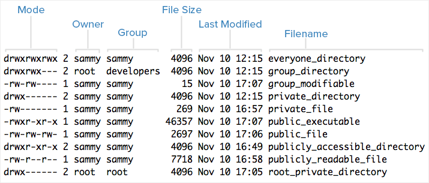

# Linux

<!-- TOC -->

- [Linux](#linux)
    - [OS](#os)
    - [GPL License](#gpl-license)
    - [File System](#file-system)
        - [windows](#windows)
        - [Linux filesystem (in Fedora)](#linux-filesystem-in-fedora)
            - [Fedora分区情况](#fedora分区情况)
    - [Linux目录](#linux目录)
        - [Introduction](#introduction)
        - [user directory](#user-directory)
        - [绝对路径与相对路径](#绝对路径与相对路径)
    - [File Permissions](#file-permissions)
        - [About users](#about-users)
        - [About Groups](#about-groups)
        - [Viewing Ownership and Permissions](#viewing-ownership-and-permissions)
    - [linux login](#linux-login)
    - [kali linux](#kali-linux)

<!-- /TOC -->

## OS

[Linux](www.kernel.org)是一套免费的、源代码开放的、符合POSIX标准规范的操作系统;
>POSIX: Portable Operating System Interface是为解决应用程序平台移植性提出的一种标准


严格的Linux只包括: kernel+shell;


主要功能:
- CPU management
- Storage management
- Device management
- File management
- Network& Communication management
- User interface: GUI, commandline....

shell: 命令解释器，它解释由用户输入的命令并且把它们送到内核执行

## GPL License

GPL(GNU General Public License)规定了软件使用自由度的下限。一个软件挂上了GPL版权声明之后，它自然就成了自由软件，具有如下特性：
- 在发行软件时必须同时发布软件的源码
- 复制：可以自由复制该软件
- 修改：可以将获取的源码进行修改，使之适合自己的工作
- 再发行：您可以将修改过的程序再度自由发行
- 回馈：您应该将您修改过的程序代码回馈于社会
- 不能修改授权：一个GPL授权的自由软件，在您修改后，不能取消GPL授权（传染性）
- 不能单纯销售：您不能单纯销售自由软件

## File System


windows下点击计算机看到的是各个盘符；Linux下点击计算机看到的都是文件夹(目录)

### windows

每个驱动器都有自己的根目录结构，这样形成了多个树并列的情形


### Linux filesystem (in Fedora)

Linux系统: **一切皆文件**

Linux硬件命名规则:
- `/dev/hd[a-d]`: IDE硬盘
- `/dev/sd[a-p]`: SCSI硬盘
- `/dev/cdrom`: cd rom
- `/dev/lp[0-2]`: printer
- `/dev/mouse`: mouse
- `/dev/eth`: 网卡, n从0开始

Linux图形模式与文字模式切换:
- `Ctrl+Alt+[F1]~[F6]`: 文字界面tty1~tty6; VMWare中使用`Ctrl+Alt+Shift+[F1]~[F6]`
- `Ctrl+Alt+[F7]~[F8]`: 图形界面


DeviceType:

- Patition(普通的分区)
- LVM volume group(logical volume management)
- Btrfs volume(next generation 被RHEL抛弃)

Fedora默认分区方案


#### Fedora分区情况

```bash
#一般的处理方法
#/dev/sda这是Linux系统下的设备文件，类似Windows系统上面的本地磁盘、U盘、光驱等设备。Linux系统访问设备文件需要mount命令挂载映射成文件，查看

mkdir /mnt/sda1
#通过mkdir命令创建文件夹

mount /dev/sda1 /mnt/sda1
#挂载/dev/sda1到/mnt/sda1目录下
#其中/dev/sda1是一个设备文件
#/dev/sd* device files are for SCSI, SATA disks.

cd /mnt/sda1
#cd 命令进入该目录，就可以看到分区存放的文件了
```

使用的是`blivet-gui`分区工具

我有三个SATA disk(**sda**, **sdb**, **sdc**),都分成2区;

sda分成了partition的sda1和lvm的sda2


sdb都分成了partition的sdb1，partition的sdb2


sdb都分成了lvm的sdc1，partition的sdc2;

其中sdc1属于sdcLVM分组，也可以并入fedora分组，扩容fedora;

先查看一下sdc1对应`/dev/dm-2`然后并入fedora分组`vgextend fedora /dev/dm-2`


```bash
#查看设备文件
ls /dev/sd*
#result
#表示有三个disk,
/dev/sda  /dev/sda1  /dev/sda2  /dev/sdb  /dev/sdb1  /dev/sdb2  /dev/sdc  /dev/sdc1  /dev/sdc2

#
df -lh
```

## Linux目录

### Introduction

$$
/\left\{ \begin{array}{l}
	/bin\\
	/sbin\\
	/usr\left\{ \begin{array}{l}
	bin\\
	local\rightarrow include\\
	lib\\
\end{array} \right.\\
	/lib\\
	/home\left\{ \begin{array}{l}
	Grey\\
	James\\
	...\\
\end{array} \right.\\
	...\\
\end{array} \right. 
$$

**/**: 根目录，一般根目录下只存放目录，在Linux下有且只有一个根目录。所有的东西都是从这里开始。当你在终端里输入“/home”，你其实是在告诉电脑，先从/（根目录）开始，再进入到home目录。

**/bin**: /usr/bin: 可执行二进制文件的目录，如常用的命令ls、tar、mv、cat等。

**/boot**：放置linux系统启动时用到的一些文件，如Linux的内核文件：/boot/vmlinuz，系统引导管理器：/boot/grub。

**/dev**：存放linux系统下的设备文件，访问该目录下某个文件，相当于访问某个设备，常用的是挂载光驱 `mount /dev/cdrom /mnt`。

**/etc**：系统配置文件存放的目录，不建议在此目录下存放可执行文件，重要的配置文件有 /etc/inittab、/etc/fstab、/etc/init.d、/etc/X11、/etc/sysconfig、/etc/xinetd.d。

**/home**：系统默认的用户家目录，新增用户账号时，用户的家目录都存放在此目录下，~表示当前用户的家目录，~edu 表示用户 edu 的家目录。

**/lib**: /usr/lib: /usr/local/lib：系统使用的函数库的目录，程序在执行过程中，需要调用一些额外的参数时需要函数库的协助。

**/lost+fount**：系统异常产生错误时，会将一些遗失的片段放置于此目录下。

**/mnt**: /media：光盘默认挂载点，通常光盘挂载于 /mnt/cdrom 下，也不一定，可以选择任意位置进行挂载。

**/opt**：给主机额外安装软件所摆放的目录。

**/proc**：此目录的数据都在内存中，如系统核心，外部设备，网络状态，由于数据都存放于内存中，所以不占用磁盘空间，比较重要的目录有 /proc/cpuinfo、/proc/interrupts、/proc/dma、/proc/ioports、/proc/net/* 等。

**/root**：系统管理员root的家目录。

**/sbin**: /usr/sbin: /usr/local/sbin：放置系统管理员使用的可执行命令，如fdisk、shutdown、mount 等。与 /bin 不同的是，这几个目录是给系统管理员 root使用的命令，一般用户只能"查看"而不能设置和使用。

**/tmp**：一般用户或正在执行的程序临时存放文件的目录，任何人都可以访问，重要数据不可放置在此目录下。

**/srv**：服务启动之后需要访问的数据目录，如 www 服务需要访问的网页数据存放在 /srv/www 内。

**/usr**：应用程序存放目录，/usr/bin 存放应用程序，/usr/share 存放共享数据，/usr/lib 存放不能直接运行的，却是许多程序运行所必需的一些函数库文件。/usr/local: 存放软件升级包。/usr/share/doc: 系统说明文件存放目录。/usr/share/man: 程序说明文件存放目录。

**/var**：放置系统执行过程中经常变化的文件，如随时更改的日志文件 /var/log，/var/log/message：所有的登录文件存放目录，/var/spool/mail：邮件存放的目录，/var/run:程序或服务启动后，其PID存放在该目录下。

### user directory

```bash
#related command
cd ~
cd
cd /home/grey
```

### 绝对路径与相对路径

```bash
#absolute path
cd /home/grey
ls /home/grey

#relative path
cd ../../
## when already in /home/grey
cd Downloads
```

每个目录下都有`.`和`..`

`.` 表示当前目录

`..` 表示上一级目录，即父目录

`/`下的`.`和`..`都表示当前目录

## File Permissions

Linux是一个多任务多用户OS(多个用户同时访问), windows是假的多任务多用户(windows server才是多任务多用户，一般版本为单用户)

因为多用户，必须有权限的考虑

<https://www.digitalocean.com/community/tutorials/an-introduction-to-linux-permissions>

### About users

In Linux, there are two types of users: **system users** and **regular users**. Traditionally, system users are used to run non-interactive or background processes on a system, while regular users used for logging in and running processes interactively

An easy way to view all of the users on a system is to look at the contents of the /etc/passwd file. Each line in this file contains information about a single user, starting with its user name (the name before the first :). Print the passwd file with this command:

```bash
cat /etc/passwd
```

In addition to the two user types, there is the **superuser**, or **root user**, that has the ability to override any file ownership and permission restrictions.

### About Groups

```bash
cat /etc/group
```

### Viewing Ownership and Permissions

In Linux, each and every file is owned by a single user and a single group, and has its own access permissions.

```bash
ls -l
```



About Mode:


FileType:

- `-` -> normal file
- c -> character device: 键盘, 鼠标
- d -> directory
- l -> symbolic link
- s -> Unix socket
- b -> block device: 可供储存的接口设备
- p -> pipeline
- D -> Door

Permissions Classes:(**ugoa**)

- **User**: The **owner** of a file belongs to this class
- **Group**: The **members** of the file's group belong to this class
- **Other**: Any users that are not part of the **user** or **group** classes belong to this class.
- **All**: All the above three

Triad:(**rwx**)

- **Read**: 对文件而言，view the contents of the file；对目录来说，view the names of the file in the directory
- **Write**: 对文件而言，modify and delete the file；对目录来说，delete the directory, modify its contents (create, delete, and rename files in it), and modify the contents of files that the user can read.
- **Execute**: 对文件而言，execute a file (the user must also have read permission). As such, execute permissions must be set for executable programs and shell scripts before a user can run them.；对目录了来说, access, or traverse, into (i.e. `cd`) and access metadata about files in the directory (the information that is listed in an `ls -l`).

通常，Unix/Linux系统只允许文件的属主(所有者)或超级用户改变文件的读写权限

## linux login

Linuix登录过程:
- 提示输入用户名和密码
- linux查询/etc/passwd里面是否包含该用户名
- 如果没有则退出，如果有则读取该用户的UID和 GID以及Home目录、Shell等
- linux查询/etc/shadow以核对密码
- 如果密码正确则进入shell控管范围

```bash
# /etc/passwd内容, :是分隔符
grey:x:1000:1000:Alpha Grey,100871,,:/home/grey:/bin/bash
# username:
# password(x)在/etc/shadow中:
# UID:GID:
# info:
# home directory:
# shell

# /etc/shadow内容
grey:$6$pTVg435s$dHL9X33OdDwxHdkxOFNUxGaULixW/9794x8Bpw1wK3ejN4xjdHcv4XVRZ9ONzvL5ml3qz5WoMtaXx5kP/Bvqs.:17732:0:99999:7:::

# username:
# encrypt password(*开头的不能登录):
# modify password time(from 1/1/1970):
# 密码不可被修改的天数（0表示随时可改）:
# 密码需要重新修改的天数（99999表示不用改）:
# 密码需要修改期限前的警告期限（7表示失效前7天开始提示）:
# 帐号失效期限:
# 帐号取消期限:
# 预留

# /etc/group内容
grey:x:1000:grey,james,tom

# group name:
# group password(x), 在/etc/gshadow中:
# GID
# group list
```

## kali linux

[Kali Linux 安全渗透教程](https://legacy.gitbook.com/book/wizardforcel/daxueba-kali-linux-tutorial/details)

[Kali Linux 渗透测试的艺术](https://legacy.gitbook.com/book/jobrest/kali-linux-cn/details)