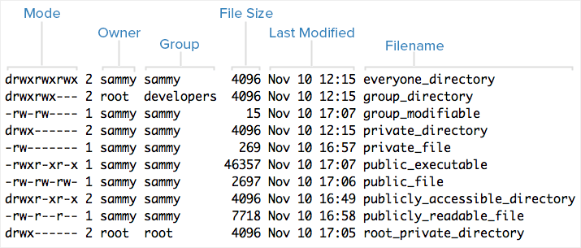
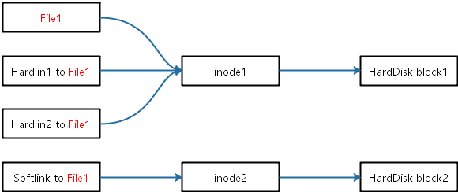

# Linux Command
<!-- TOC -->

- [Linux Command](#linux-command)
    - [Command format](#command-format)
    - [Help](#help)
    - [Auto Complete](#auto-complete)
    - [Command History](#command-history)
    - [File Management](#file-management)
        - [ls(list)](#lslist)
            - [通配符](#通配符)
        - [>, >> redirection](#--redirection)
        - [more/less 分屏显示](#moreless-分屏显示)
        - [head/tail](#headtail)
        - [file](#file)
        - [|(pipe)](#pipe)
        - [clear(clear the screen)](#clearclear-the-screen)
        - [cd(change directory)](#cdchange-directory)
        - [pwd(print working directory)](#pwdprint-working-directory)
        - [mkdir(make directory)](#mkdirmake-directory)
        - [rmdir(remove directory)](#rmdirremove-directory)
        - [rm(remove file or directory)](#rmremove-file-or-directory)
        - [ln(make link)](#lnmake-link)
        - [cat/tac(查看或者合并文件)](#cattac查看或者合并文件)
        - [grep(search in ascii file)](#grepsearch-in-ascii-file)
        - [find(find file)](#findfind-file)
        - [updatedb/locate](#updatedblocate)
        - [which/whereis](#whichwhereis)
        - [cp(copy)](#cpcopy)
        - [mv(move)](#mvmove)
        - [tar(归档管理)](#tar归档管理)
        - [gzip(pack the tar)](#gzippack-the-tar)
    - [Account, Permission](#account-permission)
        - [whoami(current user)/id](#whoamicurrent-userid)
        - [who(查看所有登陆的用户)](#who查看所有登陆的用户)
        - [exit(exit logined user)](#exitexit-logined-user)
        - [su(super user)](#susuper-user)
        - [groupadd, groupdel](#groupadd-groupdel)
        - [usermod](#usermod)
        - [useradd](#useradd)
        - [passwd(设置用户密码)](#passwd设置用户密码)
        - [userdel](#userdel)
        - [chmod](#chmod)
            - [字母法](#字母法)
            - [数字法](#数字法)
        - [chown(change owner)](#chownchange-owner)
        - [chgrp(change group)](#chgrpchange-group)
    - [System management](#system-management)
        - [cal(calendar)](#calcalendar)
        - [date](#date)
        - [ps(process status)](#psprocess-status)
        - [top(dynamical Process viewer)](#topdynamical-process-viewer)
        - [kill](#kill)
        - [reboot, shutdown, init, halt](#reboot-shutdown-init-halt)
        - [df/du](#dfdu)
        - [ifconfig(Interface configurator)](#ifconfiginterface-configurator)
        - [ping](#ping)
        - [free, uname, uptime](#free-uname-uptime)
    - [su](#su)

<!-- /TOC -->

## Command format

```bash
command  [-options]  [parameter1]  …
```

`command`: 命令名,相应功能的英文单词或单词的缩写

`[-options]`：选项,可用来对命令进行控制，也可以省略

`[]`代表可选

`parameter1 …`：传给命令的参数：可以是零个一个或多个

```bash
#examples
ls -lh /dev/sd*
```

## Help

```bash
# method 1: --help
ls --help

# method 2: man
man ls
man 1 ls
man 2 printf
```

man是linux提供的一个手册，包含了绝大部分的命令、函数使用说明

该手册分成很多章节（section），使用man时可以指定不同的章节来浏览。

man是按照手册的章节号的顺序进行搜索的。

man中各个section意义如下：

1. Standard commands（标准命令）
2. System calls（系统调用，如open,write）
3. Library functions（库函数，如printf,fopen）
4. Special devices（设备文件的说明，/dev下各种设备）
5. File formats（文件格式，如passwd）
6. Games and toys（游戏和娱乐）
7. Miscellaneous（杂项、惯例与协定等，例如Linux档案系统、网络协定、ASCII 码；environ全局变量）
8. Administrative Commands（管理员命令，如ifconfig）

## Auto Complete

在敲出命令的前几个字母的同时，按下tab键，系统会自动帮我们补全命令

## Command History

```bash
#Method 1
history

#Method 2
```

使用`↑`和`↓`键

## File Management

### ls(list)

类似于DOS下的`dir`命令

```bash
#Common
## all(wiil show hidden files & directories)
cd -a
##long format(detailed)
cd -l
##human readable
cd -h

#example1
ls -lh /dev/sd*
ls /

#example2
cd /home
ls -a
##You will see the . and ..
```

Linux文件或者目录名称最长可以有265个字符，“.”代表当前目录，“..”代表上一级目录，以“.”开头的文件为隐藏文件，需要用 -a 参数才能显示。



#### 通配符

linux [wildcard](http://www.tldp.org/LDP/GNU-Linux-Tools-Summary/html/x11655.htm)

```bash
#wildcard *
ls *.cpp
ls grey*

## wildcard ?

ls gr?y

##wildcard []
###匹配a、b、c中的任意一个
ls [abc].cpp
###匹配从a到f范围内的的任意一个字符
ls [a-f].cpp
ls [a-f]*

##当“-”处于方括号之外失去通配符的作用
ls a-f

##转义字符 \
###查找文件名为*a的文件
ls \*a
```

### >, >> redirection

`>`输出重定向会覆盖原来的内容，`>>`输出重定向则会追加到文件的尾部

```bash
ls > myTest.txt
##显示文本内容
cat myTest.txt
```

### more/less 分屏显示

查看内容时，在信息过长无法在一屏上显示时，会出现快速滚屏，使得用户无法看清文件的内容，此时可以使用more命令，每次只显示一页
- `d`半页
- `f`, `<space>`整页`按下空格键可以显示下一页，按下
- `q`退出显示

```bash
ps -a >myText.txt
more myTest.txt
```

### head/tail

```bash
# 输出头10行
head 1.txt
# 输出头20行
head 1.txt -n 20

# 输出尾10行
tail 1.txt
```

### file

```bash
# 查看文件类型
file 1.txt # ASCII text
```

### |(pipe)

管道：一个命令的屏幕输出可以通过管道做为另一个命令的输入。

```bash
rpm -qa|grep kernel
ps -a|more
```

### clear(clear the screen)

```bash
clear
#or Ctrl + I
```

### cd(change directory)

Linux所有的目录和文件名case-sensitive

cd后面可跟绝对路径，也可以跟相对路径

```bash
cd
cd ~

cd .
cd ./Downloads
#等价于cd Downloads

cd ..
cd ../../

#change to last directory
cd -

#如果路径是从根路径开始的，则路径的前面需要加上 “ / ”
cd /boot
#如果是相对路径, 通常进入某个目录里的文件夹，前面不用加 “ / ”
cd Downloads
```

### pwd(print working directory)

```bash
#print working directory
pwd
```

### mkdir(make directory)

需要注意的是新建目录的名称不能与当前目录中已有的目录或文件同名，并且目录创建者必须对当前目录具有写权限。

```bash
#make directory
mkdir chapter01
mkdir chapter01/section01

##another,p is recursive
mkdir -p chapter02/section01
```

### rmdir(remove directory)

```bash
#用得少
man rmdir
```

### rm(remove file or directory)

```bash
#recursive remove(with directory)
rm chapter01 -r

#force remove
rm chapter02 -rf

#interactive remove
rm chapter02 -ri
```

### ln(make link)

要理解`ln`, 首先要理解[inode](http://www.ruanyifeng.com/blog/2011/12/inode.html)(index node), Unix/Linux系统内部不使用文件名，而使用inode号码来识别文件

打开文件系统内部这个过程分成三步：
- 系统找到这个文件名对应的inode号码；
- 通过inode号码，获取inode信息；
- 根据inode信息，找到文件数据所在的block，读出数据。



```bash
# 查看文件的inode
stat 1.py
# 查看文件的inode编号
ls -li 1.py

# 查看硬盘上inode所占的size
df -i
sudo dumpe2fs -h /dev/vda1 | grep "Inode size" #256MB
```

inode特殊作用: 移动文件或重命名文件，只是改变文件名，不影响inode号码

链接文件分为**软链接**和**硬链接**(Hard link/Symbolic link)

硬链接：对文件内容进行修改，会影响到所有文件名；但是，删除一个文件名，不影响另一个文件名的访问; 

硬链接限制:
- 目录只有硬链接只能链接普通文件`-`，不能链接目录`d`; [详细解释](https://blog.csdn.net/TODD911/article/details/8756697);
- 因为不同文件系统有不同的inode table, 所以不能跨文件系统;

>创建目录时，默认会生成两个目录项："."和".."。前者的inode号码就是当前目录的inode号码，等同于当前目录的"硬链接"；后者的inode号码就是当前目录的父目录的inode号码，等同于父目录的"硬链接"。所以，任何一个目录的"硬链接"总数，总是等于2加上它的子目录总数（含隐藏目录）。


软链接：如图, block2中的内容是File1的directory; 所以删除File1, 软链接会报错; 类似windows的快捷方式;

>注意：如果软链接文件和源文件不在同一个目录，源文件要使用绝对路径，不能使用相对路径。

```bash
#hard link
ln hello.cpp hello_hard
ln hello.cpp hello_hard.cpp

#soft link,Terminal会以不同的颜色显示
ln -s hello.cpp hello_soft
ln -s hello.cpp hello_soft.cpp
g++ hello_soft.cpp
./a.out
```

### cat/tac(查看或者合并文件)

- cat: 从第一行开始显示
- tac: 从最后一行开始显示

```bash
#查看
cat 1.txt
cat -n 2.txt # 显示行号

#合并
cat 1.txt 2.txt >3.txt
cat 3.txt
```

### grep(search in ascii file)

```bash
# 当前目录包含 calc的行
grep -r calc
```

grep支持regex

```bash
#以Libre开头
rpm -qa|grep "^Libre"
#以office结尾
rpm -qa|grep "office$"
```

强大的文本搜索工具，grep允许对文本文件进行模式查找。如果找到匹配模式， grep打印包含模式的所有行

```bash
#usually one
rpm -qa|grep kernel

#grep format
grep [-options] 'string' FileName
grep [-options] "string" FileName

#examples
##显示不包含匹配文本的所有行（相当于求反）
grep -v "cout" test.cpp

##显示匹配行及行号
grep -n "cout" test.cpp

##忽略大小写
grep -n "COUT" test.cpp
```

grep搜索内容串可以是正则表达式。

正则表达式是对字符串操作的一种逻辑公式，就是用事先定义好的一些特定字符、及这些特定字符的组合，组成一个“规则字符串”，这个“规则字符串”用来表达对字符串的一种过滤逻辑。

```bash
#begin with i
grep "^i" test.cpp

#end with >
grep ">$" test.cpp

#匹配 [] 里中一系列字符中的一个；搜寻匹配单词signal、signaL、Signal、SignaL的行；
grep '[Ss]igna[Ll]' 1.txt

#(点)匹配一个非换行符的字符；匹配 e 和 e 之间有任意一个字符，可以匹配 eee，eae，eve，但是不匹配 ee，eaae；
grep 'e.e' 1.txt
```

### find(find file)

在特定的目录下搜索符合条件的文件，也可以用来搜索特定用户属主的文件

```bash
find -name *.cpp
find ./ -name *.cpp
find ./ -name '*.cpp'
##Linux下''与""似乎等价

#查找当前目录下所有以大写字母开头的文件
find ./ -name "[A-Z]*"

#查找在/tmp 目录下等于2M的文件
find /tmp size 2M
#查找在/tmp 目录下大于2M的文件
find /tmp +size 2M
#查找在/tmp 目录下小于2M的文件
find /tmp -size 2M
#查找当前目录下大于4k，小于5M的文件
find ./ -size +4k -size -5M
#查找当前目录下权限为 777 的文件或目录
find ./ -perm 0777
```

### updatedb/locate

updatedb会根据/etc/updatedb.conf 中配置，为你计算机中的文件建立索引。(需 要root权限)

```bash
sudo updatedb
locate README.md
```
### which/whereis

查看command所在的位置

```bash
which ls
which python

# 列出python的binary, doc...
whereis python
```

### cp(copy)

```bash
#该选项通常在复制目录时使用，它保留链接、文件属性，并递归地复制目录，简单而言，保持文件原有属性
cp -a test.cpp anotherTest.cpp
#已经存在的目标文件而不提示
cp -f test.cpp anotherTest.cpp
#交互式复制，在覆盖目标文件之前将给出提示要求用户确认
cp -i test.cpp anotherTest.cpp
#若给出的源文件是目录文件，则cp将递归复制该目录下的所有子目录和文件，目标文件必须为一个目录名
cp -r test.cpp anotherTest.cpp
#显示进度
cp -v test.cpp anotherTest.cpp
```

### mv(move)

用户可以使用mv命令来移动文件或目录，也可以给文件或目录重命名

```bash
mv -f test.cpp anotherTest.cpp
mv -i test.cpp anotherTest.cpp
mv -v test.cpp anotherTest.cpp
```

### tar(归档管理)

tar是Unix/Linux中最常用的备份工具，此命令可以把一系列文件归档到一个大文件中，也可以把档案文件解开以恢复数据

tar命令很特殊，其参数前面可以使用`-`，也可以不使用

```bash
#注意：除了f需要放在参数的最后，其它参数的顺序任意

#c生成档案;
#v列出归档解档的详细过程，显示进度;
#f指定档案文件名称，f后面一定是.tar文件，所以必须放选项最后
tar -cvf test.tar 1.py 2.py 3.cpp
tar -cvf test.tar *.py

#x解开档案
tar -xvf test.tar
```

### gzip(pack the tar)

tar与gzip命令结合使用实现文件打包、压缩。 tar只负责打包文件，但不压缩，用gzip压缩tar打包后的文件，其扩展名一般用xxxx.tar.gz

在tar命令中增加一个选项(-z)可以调用gzip实现了一个压缩的功能，实行一个先打包后压缩的过程

```bash
#用gzip压缩tar打包后的文件，其扩展名一般用xxxx.tar.gz
tar -zcvf zzz.tar.gz *.py
tar -zxvf zzz.tar.gz
tar -zxvf zzz.tar.gz -C /Home/Document #指定路径解压

# 查看压缩包
tar -tvf zzz.tar.gz

#用bzip2压缩tar打包后的文件，其扩展名一般用xxxx.tar.gz2
tar -jcvf jjj.tar.bz2 *.py
tar -jxvf jjj.tar.bz2

#zip to zzz.zip
zip zzz.zip *.py
#unzip to current folder
unzip zzz.zip
#unzip to NewFolder
unzip -d NewFolder zzz.zip
```

压缩程度：$gz>bz2>zip$

## Account, Permission

Unix/Linux系统中的root账号通常用于系统的维护和管理，它对Unix/Linux操作系统的所有部分具有不受限制的访问权限

### whoami(current user)/id

```bash
whoami

#for system user
cat /etc/passwd

# show id info: check if is sudoer
id
```

### who(查看所有登陆的用户)

```bash
who
```

### exit(exit logined user)

vmware的NAT模式下，的各个机器都在同一个局域网，可以互相ping

```bash
#当一个电脑有多个用户的情况下
#可以同时登陆同一个电脑的不同两个用户
ssh moris@192.168.128.132
ssh james@192.168.128.132
```

如果是图形界面，退出当前终端；

如果是使用ssh远程登录，退出登陆账户；

如果是切换后的登陆用户，退出则返回上一个登陆账号

### su(super user)

由于安全原因，一般Linux服务器是不允许root远程登录。先要以普通用户登录， 然后再用su命令切换到root用户。黑客要获取root权限，必须先拿到普通权限，增加了一层防护;

```bash
#[chris@localhost ~]$
#$表普通用户
#[root@localhost chris]#
#root用户用#表示

#log in super user
su
su - root

#long in grey user
su grey
```

`sudo`允许系统管理员让普通用户执行一些或者全部的root命令的一个工具，减少了root 用户的登陆和管理时间，提高了安全性

### groupadd, groupdel

```bash
groupadd test
groupdel test
# 组内的用户必须不在线，而且该组不存在 主用户才能删除

#查看group
cat /etc/group

groupmod+三次tab
```

### usermod

修改用户所在组

```bash
#first login root
groupadd myGroup
usermod -g myGrop Chris
```

### useradd

linux是多任务，多用户：

- 多用户（不退出当前用户的情况下，完成一些任务），比如，打开两个terminal,terminal最前面可以是不同的用户

```bash
#如果创建用户的时候，不指定组名，那么系统会自动创建一个和用户名一样的组名
useradd moriaty
useradd -g grey moriaty # add to group grey
useradd moriaty -d # create user with /home/moriaty

# ubuntu推荐adduser, 会创建home, 新建password
sudo adduser moriaty
```

新建的用户可以通过`sudo cat /etc/passwd`的最后一行查看

```bash
#整个流程
#step1, useradd添加用户
#step2, passwd添加用户密码
#step3, su切换用户
#step4, ssh连接到用户
#step5, Ctrl+Shift+T让terminal多个标签，然后Alt+1,2,3多个标签切换
```

### passwd(设置用户密码)

可以使用passwd命令为普通用户设置或修改用户口令。用户也可以直接使用该命令来修改自己的口令

```bash
#in root
passwd grey

su grey #新弄一个terminal,然后切换到grey用户

#in grey, change password
passwd
```

### userdel

```bash
#del user with 主目录
userdel -r grey

#del user without 主目录
#比如离职的时候要保留人家的内容
userdel grey
```

### chmod

chmod 修改文件权限有两种使用格式：字母法与数字法

#### 字母法

symbol|means
---|---
u|owner
g|group
o|other
a|all
+|增加权限
-|撤销权限
=|设定权限

r: read 表示可读取，对于一个目录，如果没有r权限，那么就意味着不能通过ls查看这个目录的内容

w: write 表示可写入，对于一个目录，如果没有w权限，那么就意味着不能在目录下创建新的文件

x: excute 表示可执行，对于一个目录，如果没有x权限，那么就意味着不能通过cd进入这个目录

```bash
chmod o+w test.cpp
chmod g=x test.sh
chmod o=rwx test.sh
chmod u=r,g=r,o=r test.sh
#不给权限
chmod u=,g=,o= test.sh
```

#### 数字法

symbol|number
---|---
r|4
w|2
x|1
-|0

```bash
chmod 777 test.cpp
chmod 751 file1
chmod 000 file1

#test 目录下所有文件加 777 权限
chmod 777 NewFolder/ -R
```

### chown(change owner)

`ll`第二列是指文件的硬连接数或目录所含有的子目录数

```bash
#ll=ls -l
ll
#file1 owner is chris
#change to grey
chown grey test.cpp
chown grey NewFolder

#change to grey recursively
chown grey NewFolder -R
```

### chgrp(change group)

```bash
#查看组
cat /etc/group
#或者groupmod+多个tab


#change to grey
chgrp grey test.cpp
chgrp grey NewFolder

#change to grey recursively
chgrp grey NewFolder -R
```

## System management

### cal(calendar)

```bash
cal
cal -y
cal -y 2008
```

### date

CST:central time zone

UTC:universal time zone

查看、修改日期时间

```bash
date
date > 1.txt

date '+%y/%m/%d'
date '+%Y===%m===%d'
date '+%y,%m,%d,%H,%M,%S'

#强行修改时间为01月02日03时04分2016年55秒
#其实是没有意义的，一联网，自动对时
date 010203042016.55
```

### ps(process status)

进程是一个具有一定独立功能的程序，它是操作系统动态执行的基本单元

```bash
ps #当前teminal的进程，一般只有2个
ps -a
ps -aux
```

### top(dynamical Process viewer)

任何东西退出的顺序

```bash
q
Ctrl+C
Ctrl+D
```

top命令用来动态显示运行中的进程。top命令能够在运行后，在指定的时间间隔更新显示信息。可以在使用top命令时加上-d 来指定显示信息更新的时间间隔

在top命令执行后，可以按下按键得到对显示的结果进行排序

key|meanning
---|---
m|memory
t|cpu
s|根据进程运行时间的长短来排序
u|可以根据后面输入的用户名来筛选进程
k|可以根据后面输入的PID来杀死进程

```bash
#一般
top
#高级
htop
```

### kill

kill命令指定进程号的进程，需要配合`ps`, `top`使用

```bash
#usage
kill [-signal] pid

#examples
ps -a
kill 9133
#强制终结
kill -9 9178
```

### reboot, shutdown, init, halt

```bash
#reboot
init 6
reboot
shutdown -r now

#shutdown
init 0
poweroff
shutdown -h now
halt

#with timer
shutdown -h 20:25
#shutdown after 10 min
shutdown -h +10
```

### df/du

df命令用于检测文件系统的磁盘空间占用和空余情况，可以显示所有文件系统对节点和磁盘块的使用情况)

sda1:表示第一块硬盘的第一个分区

sdb2:表示第二块硬盘的第一个分区

如果挂载了一个新的硬盘，先分区，一般会自动挂载到`/run/media/moris/DiskName`下面，只要`sudo chgrp moris DiskName -R`,`sudo chown moris DiskName -R`就好了

```bash
df -h
```

du命令用于统计目录或文件所占磁盘空间的大小

df注重磁盘，du注重directory

```bash
du -h
du -h /home/chris
du -sh # directory total size
```

### ifconfig(Interface configurator)

有几坨，就有几个网卡，其中`lo`表示本地回环，用于测试机器网络功能是不是好的

如果是一般的wifi(不是校园网的那种)，虚拟机和主机之间可以互相ping

```bash
ifconfig
#change ip address
sudo ifconfig ens33 192.168.1.110

#modern distributions ifconfig has been depracated, use ip instead
ip address
```

### ping

```bash
#stop by Ctrl+C
ping 10.128.160.66
```

### free, uname, uptime

```python
# check memory
free
# system info
uname -a
# system run time
uptime
```

## su

```bash
#任意账户切换到root，需要知道root密码
su

#sudoer file中的切换到root,其他人切换会被report给管理员
sudo -s
sudo - root

#添加进入sudo组,要在另一个账户中
sudo usermod -a -G adm james #for fedora

sudo usermod -a -G sudo james #for debian
sudo usermod -a -G adm james #for debian, 第二种方法
```