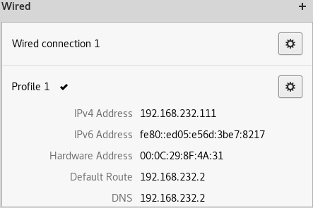

# Setting up Environment

<!-- TOC -->

- [Setting up Environment](#setting-up-environment)
    - [Introduction](#introduction)
        - [Install kali on vmware](#install-kali-on-vmware)
    - [Network basics](#network-basics)
    - [Wireless Fundamentals](#wireless-fundamentals)

<!-- /TOC -->

## Introduction

we will choose [**Kali Linux**](https://mirrors.tuna.tsinghua.edu.cn/kali-images/kali-weekly/) as OS on VMWare, and plug **USB wireless adapter**(support **Injection & Monitor**) [Realtek RTL8812AU (newly in 2017)](https://null-byte.wonderhowto.com/how-to/buy-best-wireless-network-adapter-for-wi-fi-hacking-2017-0178550/)

Attack Content:

- Pre-connection Attacks: attack without even connecting
- Gaining Access: break security mechanism and get access
- Post-connection Attacks: stay anoymous

### Install kali on vmware

分区方案:其他都不修改

type|size|format|mount points
---|---|---|---
primary|30GB|ext4|`/`
logical|10GB|ext4|`/var`
logical|8GB|swap|`swap`
logical|8GB|ext4|`/tmp`
logical|200GB|ext4|`/home`


```bash
#vmware共享
apt install open-vm-tools-desktop
```

```bash
#修改source
gedit /etc/apt/sources.list

#sources.list内容
deb https://mirrors.ustc.edu.cn/kali kali-rolling main non-free contrib
deb-src https://mirrors.ustc.edu.cn/kali kali-rolling main non-free contrib
```

网络中的用户可以看到Linux的hostname(**kali**)

检测是否可以使用网卡：`iwconfig`

```bash
#output,其中mode:Managed
wlan0     IEEE 802.11  ESSID:off/any  
          Mode:Managed  Access Point: Not-Associated   Tx-Power=20 dBm   
          Retry short  long limit:2   RTS thr:off   Fragment thr:off
          Encryption key:off
          Power Management:off
```

monitor mode: `airmon-ng start wlan0`,其中wlan0就是wireless adpater

```bash
Found 3 processes that could cause trouble.
If airodump-ng, aireplay-ng or airtun-ng stops working after
a short period of time, you may want to run 'airmon-ng check kill'

   PID Name
   561 NetworkManager
   795 wpa_supplicant
   797 dhclient

PHY	Interface	Driver		Chipset

phy0	wlan0		rt2800usb	D-Link System DWA-125 Wireless N 150 Adapter(rev.A1) [Ralink RT3070]

		(mac80211 monitor mode vif enabled for [phy0]wlan0 on [phy0]wlan0mon)
		(mac80211 station mode vif disabled for [phy0]wlan0)
```

检查wlan0:`iwconfig`

```bash
#output,这是mode:Monitor
wlan0mon  IEEE 802.11  Mode:Monitor  Frequency:2.457 GHz  Tx-Power=20 dBm   
          Retry short  long limit:2   RTS thr:off   Fragment thr:off
          Power Management:off
```

```bash
#Managed Mode与Monitor Mode切换
##Monitor to Managed
airmon-ng stop wlan0mon
##Managed to Monitor
airmon-ng start wlan0

##或者复杂的方式
ifconfig wlan0mon down
iwconfig wlan0mon mode managed
ifconfig wlan0mon up

ifconfig wlan0mon down
iwconfig wlan0mon mode monitor
ifconfig wlan0mon up
```

Quick network scan: `airodump-ng wlan0mon`

## Network basics

TCP/IP: Transmission Control Protocol/Internet Protocol

Most common TCP/IP protocols:

- HTTP,Default port 80
- HTTPS,Default port 443
- FTP,Default port 21

修改ip(最后一位,gateway不是校园网的ip)：



```bash
ifconfig

#output,修改成了111
eth0: flags=4163<UP,BROADCAST,RUNNING,MULTICAST>  mtu 1500
        inet 192.168.232.111  netmask 255.255.255.0  broadcast 192.168.232.255
        inet6 fe80::ed05:e56d:3be7:8217  prefixlen 64  scopeid 0x20<link>
        ether 00:0c:29:8f:4a:31  txqueuelen 1000  (Ethernet)
        RX packets 4972  bytes 5021336 (4.7 MiB)
        RX errors 0  dropped 0  overruns 0  frame 0
        TX packets 2643  bytes 306095 (298.9 KiB)
        TX errors 0  dropped 0 overruns 0  carrier 0  collisions 0

lo: flags=73<UP,LOOPBACK,RUNNING>  mtu 65536
        inet 127.0.0.1  netmask 255.0.0.0
        inet6 ::1  prefixlen 128  scopeid 0x10<host>
        loop  txqueuelen 1000  (Local Loopback)
        RX packets 104  bytes 5652 (5.5 KiB)
        RX errors 0  dropped 0  overruns 0  frame 0
        TX packets 104  bytes 5652 (5.5 KiB)
        TX errors 0  dropped 0 overruns 0  carrier 0  collisions 0

wlan0: flags=4099<UP,BROADCAST,MULTICAST>  mtu 1500
        ether 46:c7:4d:26:96:0c  txqueuelen 1000  (Ethernet)
        RX packets 0  bytes 0 (0.0 B)
        RX errors 0  dropped 0  overruns 0  frame 0
        TX packets 0  bytes 0 (0.0 B)
        TX errors 0  dropped 0 overruns 0  carrier 0  collisions 0
```

修改domain name:

```bash
#修改localhost为greygreygrey.com
ping localhost
#output
PING localhost(localhost (::1)) 56 data bytes
64 bytes from localhost (::1): icmp_seq=1 ttl=64 time=0.026 ms
64 bytes from localhost (::1): icmp_seq=2 ttl=64 time=0.143 ms
64 bytes from localhost (::1): icmp_seq=3 ttl=64 time=0.129 ms
64 bytes from localhost (::1): icmp_seq=4 ttl=64 time=0.128 ms
64 bytes from localhost (::1): icmp_seq=5 ttl=64 time=0.133 ms
^C
--- localhost ping statistics ---
5 packets transmitted, 5 received, 0% packet loss, time 4093ms
rtt min/avg/max/mdev = 0.026/0.111/0.143/0.045 ms
```

```bash
#gedit /etc/hosts
127.0.0.1	localhost
127.0.1.1	kali

#with change
127.0.0.1	greygreygrey.com
127.0.1.1	kali
```

```bash
ping greygreygrey.com
#output
PING greygreygrey.com (127.0.0.1) 56(84) bytes of data.
64 bytes from greygreygrey.com (127.0.0.1): icmp_seq=1 ttl=64 time=0.014 ms
64 bytes from greygreygrey.com (127.0.0.1): icmp_seq=2 ttl=64 time=0.062 ms
64 bytes from greygreygrey.com (127.0.0.1): icmp_seq=3 ttl=64 time=0.058 ms
64 bytes from greygreygrey.com (127.0.0.1): icmp_seq=4 ttl=64 time=0.062 ms
64 bytes from greygreygrey.com (127.0.0.1): icmp_seq=5 ttl=64 time=0.035 ms
64 bytes from greygreygrey.com (127.0.0.1): icmp_seq=6 ttl=64 time=0.065 ms
^C
--- greygreygrey.com ping statistics ---
6 packets transmitted, 6 received, 0% packet loss, time 5123ms
rtt min/avg/max/mdev = 0.014/0.049/0.065/0.019 ms
```

修改Mac Address(Media Access Control):All devices on **same** network has different MAC address,**MAC Filtering** as Security measure(通过修改MAC很容易bypass)

获取mac address: `ifconfig eth0|grep ether`,然后在[MacVendor](https://macvendors.com/)上面查看厂家

路由器也有mac address:

```bash
#修改mac
##Set random vendor MAC of the same kind
macchanger -a eth0
##in random way
macchanger -r eth0

#output
Current MAC:   00:0c:29:8f:4a:31 (VMware, Inc.)
Permanent MAC: 00:0c:29:8f:4a:31 (VMware, Inc.)
New MAC:       cc:8c:e3:23:72:48 (Texas Instruments)
```

## Wireless Fundamentals

Encryption & authentication:

- WEP:too easy
- WPA
- WPA2(PSK)
- WPA2(Enterprise)

BSSID: Basic Service Set Identification(uniuqe mac address of other device)

ESSID: Extended Service Set Identification(BSSID的英文简记)